# Käyttöohje

## Johdanto
Tämä käyttöohje opastaa käyttäjää sovelluksen käytössä. Ohjeessa selitetään myös, kuinka voit luoda raportteja.

---

## 1. Sovelluksen käynnistäminen
Käynnistä sovellus terminaalissa seuraavalla komennolla:
```bash
  npm run dev
```
Sovellus avautuu selaimessa osoitteessa:  http://localhost:5173

---
## 2.Tiedostojen lataaminen
- Jos olet aiemmin ladattu kansion sovellukseen, sovellus muistaa sen automaattisesti. Muussa tapauksessa sovellus avaa ikkunan, josta voit valita ladattavan kansion.
- Painaa “**Valitse kansio**” – painiketta ladataa kansion.
  - Näet käyttöoikeuspyynnön ikkuna. Valitse  “**Allow**” (Salli)
  
    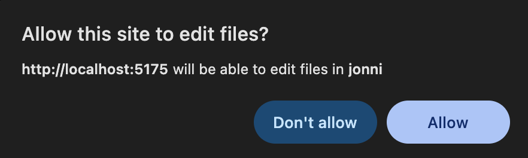

- Ladattu kansion nimi näkyy näytöllä. Kansion nimen oikealla puolella on painikke “**Poista**”, josta voit poista ladatun kansion.
    
  

- Tiedostojen määrä lasketaan automaattisesti.
  
  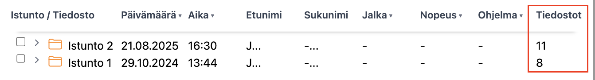
    
---

## 3. Tiedostojen haku 
-	Haku nimellä:
  
  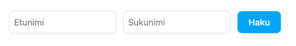

Voit etsiä tiedostoja nimien perusteella. Kirjoita asiakkaan etunimi tai sukunimi tai molemmat ja paina “**Haku**”. 

- Turvahaku:

  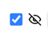

    - Valittuna: Asiakkaan koko nimi ei näy, vain ensimmäinen kirjain.
    - Ei valittuna: Asiakkaan koko nimi näytetään.
---

## 4. Tiedostojen suodatus ja valinta

  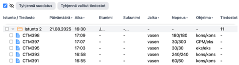

### 4.1 Tiedostojen suodatus

-	Istuntoa voi lajitella päivämäärän ja/tai ajan mukaan.
-	Tiedostoja voi lajitella ajan mukaan ja suodattaa jalan puolen nopeuden ja ohjelmatyypin perustella.
- Valitse suodatukset pudotusvalikoista:

    - **Päivämäärä:** ja **Aika**: Uudet, Vanhat.
    - **Jalka:** vasen, oikea
    - **Nopeus:** 60/60, 240/240, 30/30, 30/300, 180/180
    - **Ohjelma:** kons/kons, eks/eks, CPM/eks

- Esimerkki: Jos haluat suodattaa vain **kons/kons** -ohjelmatyypin, klikkaa ohjelmatyypikohdan nuolta, avaa pudotusvalikko ja valitse **kons/kons**. Valittu tyyppi näkyy “**Ohjelma**” -kohdan alla.
  - Kun tyyppi on valittu, klikkaa "**Ohjelma**" uudelleen avataksesi pudotusvalikon. Toisella klikkauksella voit sulkea pudotusvalikon ja poistaa suodatuksen.

  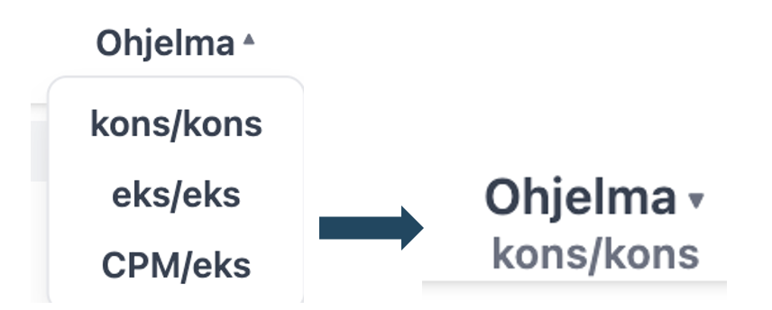

- Jos jotakin suodatuksia on valittuna,  “**Tyhjennä suodatus**” -painike muuttuu punaiseksi. Klikkaa sitä poistetaan kaikki suodattimet.

  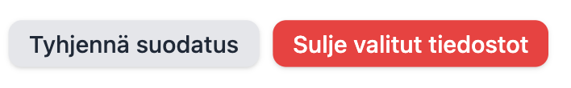

### 4.2 Tiedostojen valinta ja poista avalinnasta
-	Voit valinta kaikki istunnon tiedostot klikkaamalla valintaruutua istunnon nimen edessä.
Kun kaikki tiedostot on valittu, Istunnon nimen edessä valintaruutu  näytetään:
    
      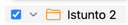

  - Yksittäisen tiedoston voi valita klikkamalla sen valintaruutua.
         Kun vain osa tiedostoista on valittu, Istunnon nimen edessä valintaruutu  näytetään: 

    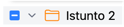
   
-	Kun tiedostoja valittuna, “**Tyhjennä valitut tiedostot**” -painike muuttuu punaiseksi.

  


-	Valinnan poistaminen
     -	Klikkaa valintaruutua uudelleen poistetaan valinnan.
     -	Klikkaa “**Sulje valitut tiedostot**” poistetaan kaikki valinnat tiedostot.
     
Kun olet valinnut haluamasi tiedostot, voit sulkea ikkunan ja siirtyä tietostojen analysointiin. 

---
## 5. Analyysisivun ohjauspaneeli
### 5.1 Tiedostot ja tulostus

  

-	**Tiedostot**: Avaa ikkuna, jossa voit ladata, suodattaa ja valinta tiedostoja analyysiä varten.
-	**Tulosta**: Luo tulostettavan PDF-raportin nykyisestä analyysinäkymästä(sisältää kaaviot ja valitut parametrit)

### 5.2 Tietojen näyttöasetukset

  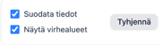

-	Käytä valintaruutuja määrittääksesi, mitä tietoja näytetäään tai piilotetään graafikuvassa.
     -	**Suodata tiedot**: Suodattaa tai tasoittaa raakadataa, jotta kaavioiden luettavuus paranee.
     -	**Näytä virhealueet**: Näyttää varjostetut virhemarginaalit piirrosviivojen ympärillä.
     - 
### 5.3 oista kaikki käsiteltävät tiedostot
-	**Sulje tiedostot**  -painike:
     -	Kun hiiren painikkeen päälle, se muuttuu punaiseksi.
-	Klikkaamalla sitä poistetaan kaikki valitut käsiteltävät tiedostot ja avaa ikkunan, josta voit ladata, suodattaa ja valinta tiedostoja analyysiä varten.

  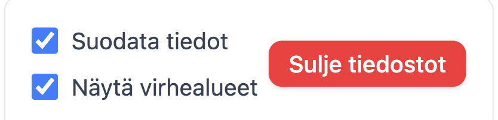

### 5.4 Ohjelmatyypin valinta

  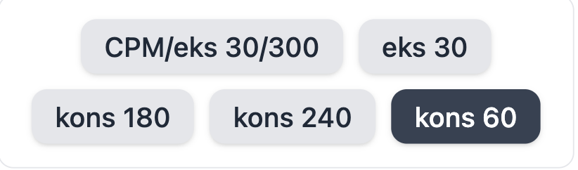

  Valittujen tiedostojen ohjelmatyypit näkyvät painikkeina. Voit valita, mikä ohjelmatyyppi haluat näyttää, klikkaamalla vastaavaa painiketta.
  
### 5.5 Valittujen tiedostojen näyttö ja hallinta

  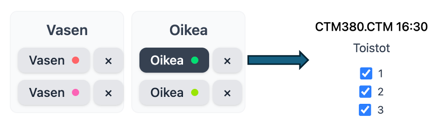

-	Vasemmalla puolella on kaksi osioita -**Vasen** ja **Oikea**, jossa kummassakin on tiedostot.
     -	Jokaisella tiedostolla on oma värimerkintä(piste)
     -	“**x**” -painikkeella voit poistaa tiedoston analyysista.
     -	Valittu tiedosto korostetaan(tummemalla taustalla)
-	Oikealla puolella näkyy valitun tiedoston yksityiskohdat, esimerkkiksi:
     -	Tiedoston nimi ja aika “**CTM380.CTM 16:30**”
     -	Lista toistosta(1, 2, 3) valintaruutuina.

### 5.6 Toistojen valinta
Toistot voi näyttää tai piilottaa valintaruudun avulla.

  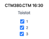
